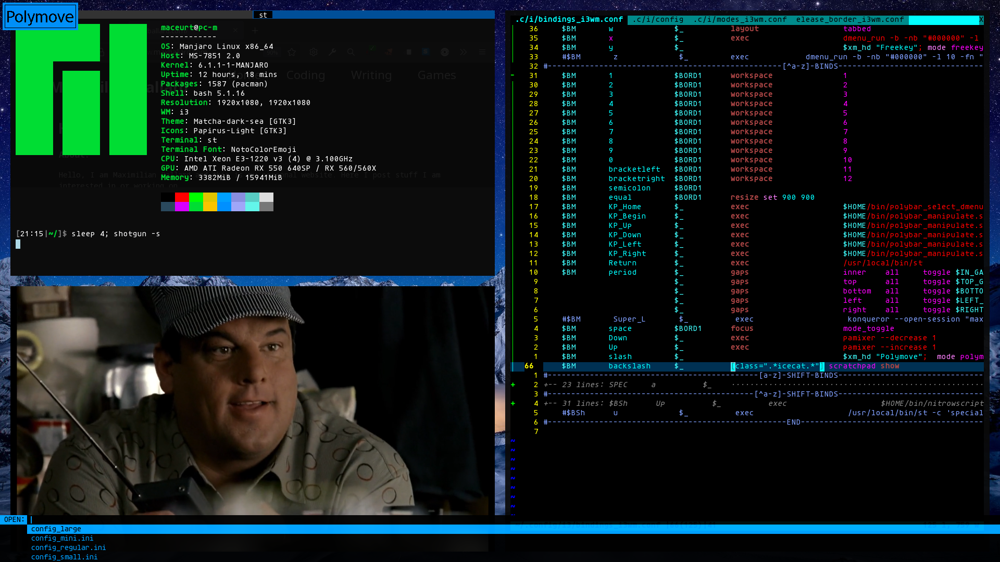
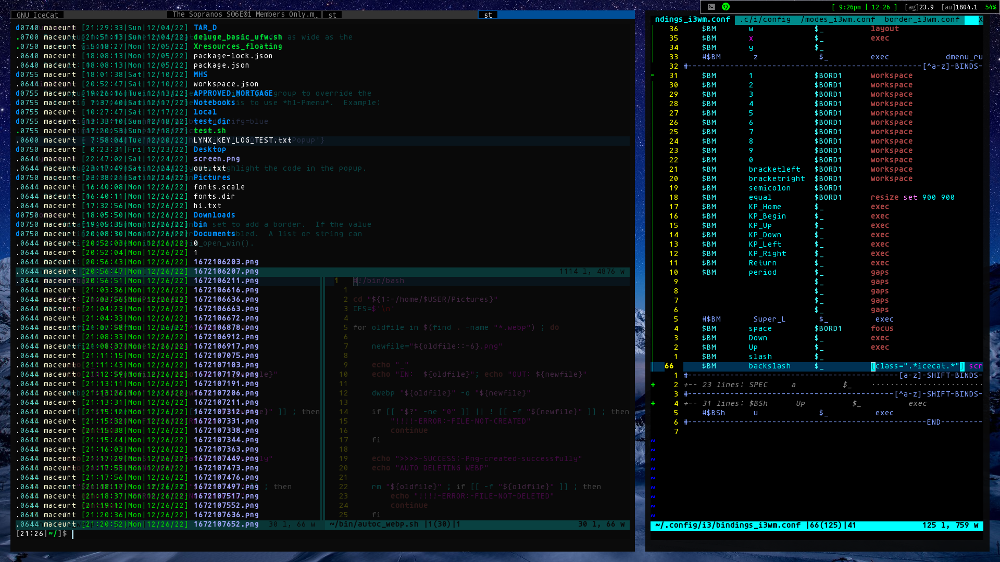

# My GNU/Linux Config Files

**Greetings** im Maximilian Ballard and these are my configuration files for my system.

Software I use:

    Distro:                     manjaro
    Display Manager:            ly
    Window Manager/Desktop:     i3wm
    Editor:                     neovim
    Pager:                      most
    File Manager:               lf/thunar
    Terminal Emulator:          st (Luke Smith's fork: https://github.com/LukeSmithxyz/st)
    Shell:                      bash
    Compositor:                 xcompmgr

Cool Software:                      

    polybar, xwallpaper, mpv, zathura, lf, nsxiv, dmenu, deluge, xcmenu, xmessage, dunst, w3m, links, lynx, qutebrowser

Images of my Desktop:

