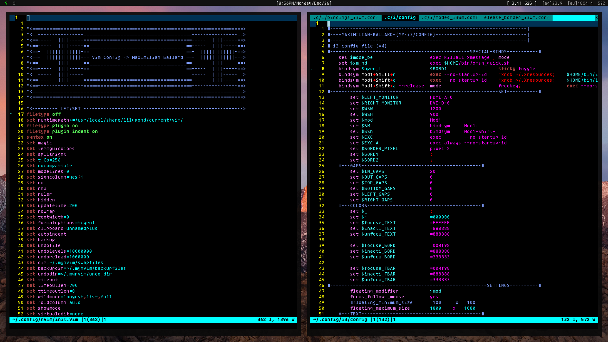

# My GNU/Linux Config Files

**Greetings** im Maximilian Ballard and these are my configuration files for my system.

Software I use (***not all configs included in this repo***):

    Distro:                     Manjaro/Artix
    Display Manager:            ly/sddm
    Window Manager/Desktop:     i3wm/xfce/plasma
    Editor:                     neovim
    Pager:                      most
    File Manager:               lf/Konqueror/Thunar
    Terminal Emulator:          st (Luke Smith's fork: https://github.com/LukeSmithxyz/st)
    Shell:                      Bash
    Compositor:                 xcompmgr

Other Cool Software:                      

    polybar, nitrogen, mpv, zathura, nsxiv, brave, dmenu, deluge, copyq, clementine, dunst, yad, w3m, kitty

Images of my Desktop:

