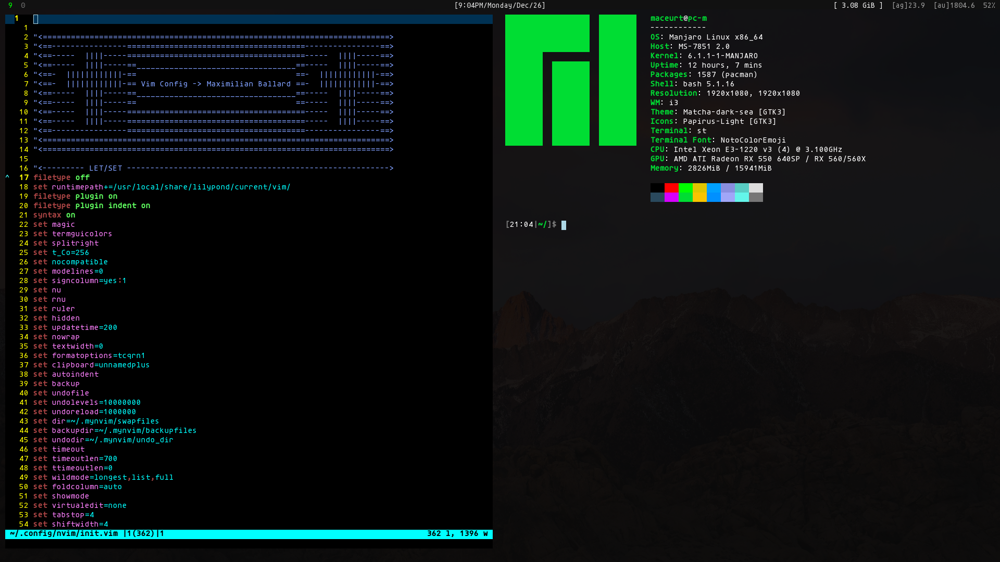
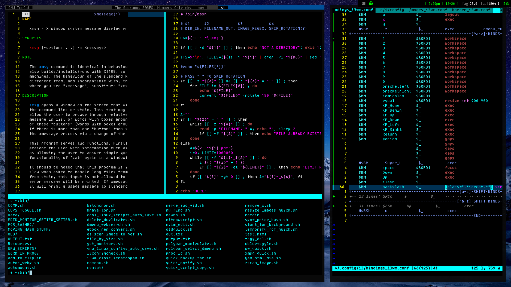
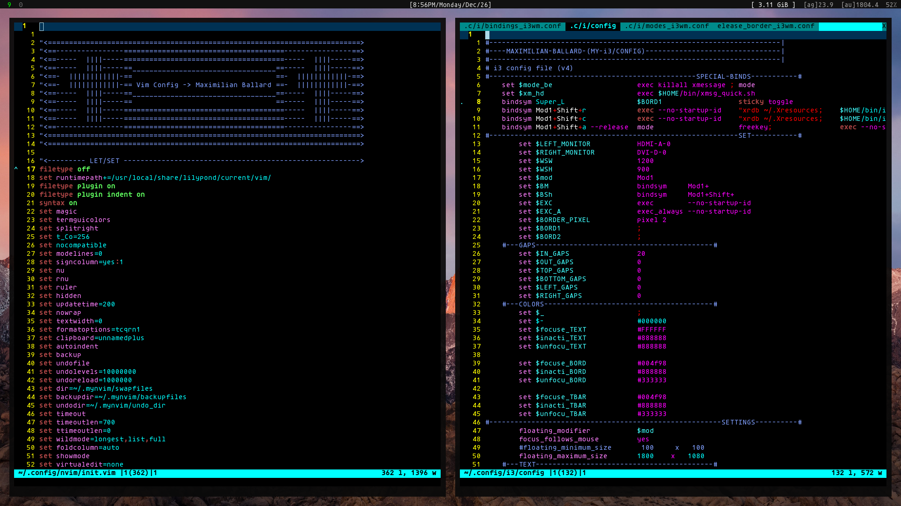
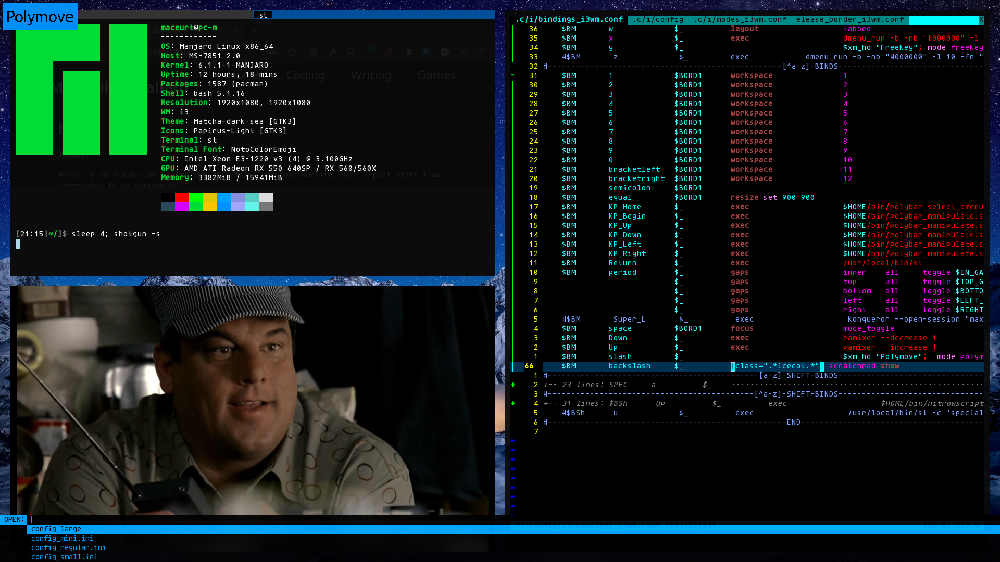
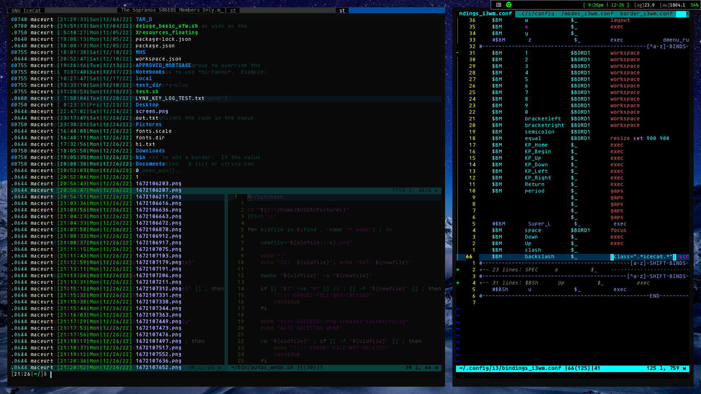
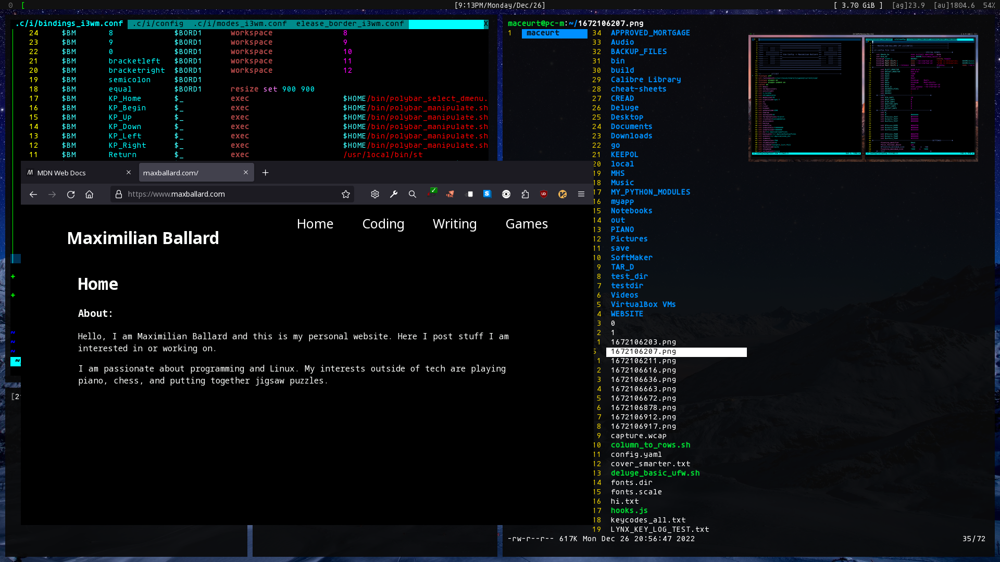
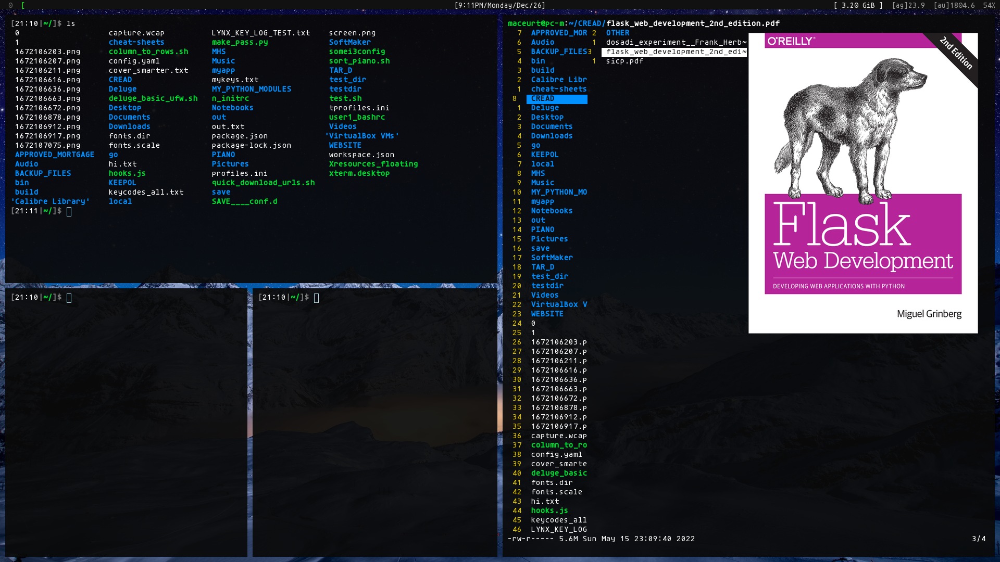
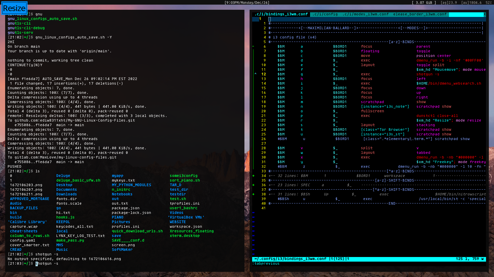

# My GNU/Linux Config Files

Configuration files for my system

Software I use:

``` text
Distro:                     manjaro, artix
Display Manager:            lightdm
Window Manager/Desktop:     i3wm
Editor:                     neovim
Pager:                      most/nvim
File Manager:               lf/thunar
Terminal Emulator:          kitty
Shell:                      bash
Compositor:                 picom
```

Cool Software:

``` text
polybar, xwallpaper, mpv, zathura, lf, nsxiv, dmenu, deluge, xcmenu, xmessage, dunst, w3m, links, lynx, qutebrowser, worker
```

<!-- Images of my Desktop: 








 -->
